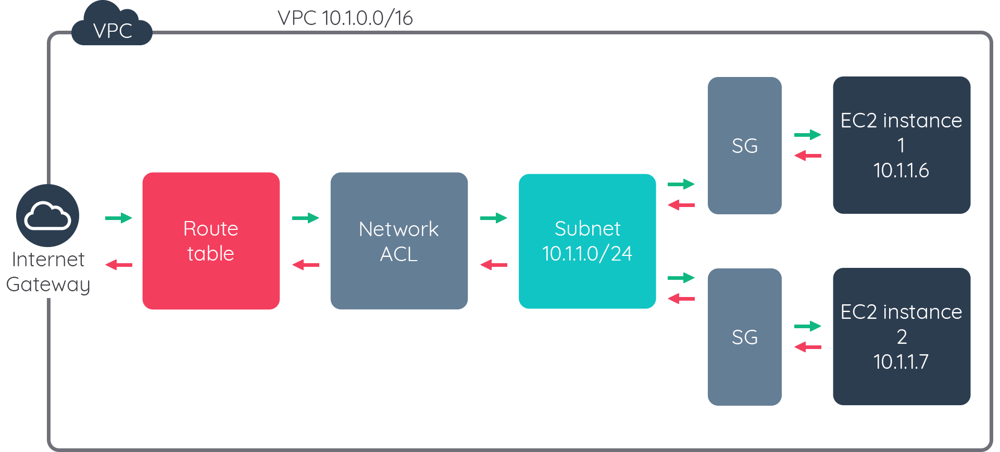

## Ikhtisar Jaringan Di AWS Bagian 1

1. Kita telah belajar tentang Amazon VPC dan beberapa kategorinya berdasarkan kasus penggunaan, seperti satu VPC dalam satu akun, banyak VPC dalam satu akun, dan banyak VPC dalam beberapa akun.

2. Kita juga telah membahas mengenai subnet, gateway, dan keamanan jaringan secara mendalam.

3. Gunakan hal-hal yang kita pelajari untuk membentuk pertahanan jaringan multi-layer.
.
Konfigurasi-konfigurasi yang ada di Route Table, Network ACL, dan Security Group pada dasarnya berguna untuk kita mengatur dan mengarahkan lalu lintas jaringan di dalam VPC.Gunakan masing-masing komponen sebagai satu kesatuan dalam membentuk pertahanan jaringan kita. Gambar di atas dapat membantu memvisualisasikan hubungan masing-masing komponen.

4. Berikut adalah hal-hal mendasar yang harus dilakukan untuk memastikan akses internet dari dalam VPC.

    1. Tempatkan Internet Gateway di VPC.
    2. Pastikan ada route di dalam Route Table yang menunjuk ke Internet Gateway.
    3. Pastikan EC2 instance memiliki Public IP atau Elastic IP.
    4. Pastikan Network ACL dan Security Group memperbolehkan akses yang relevan.
