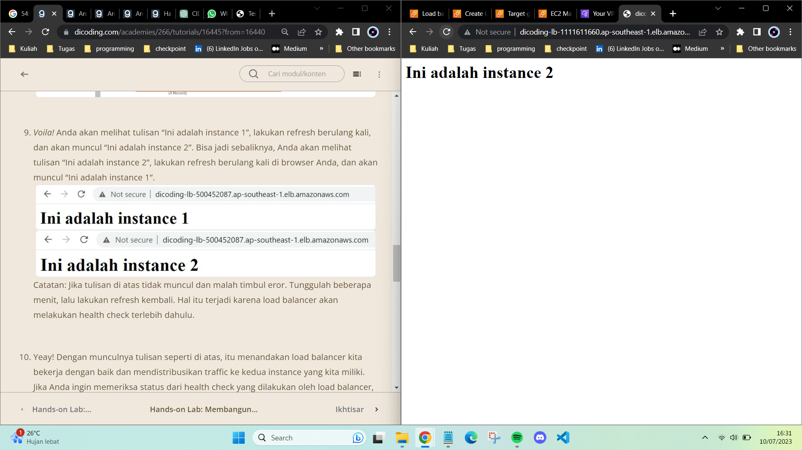
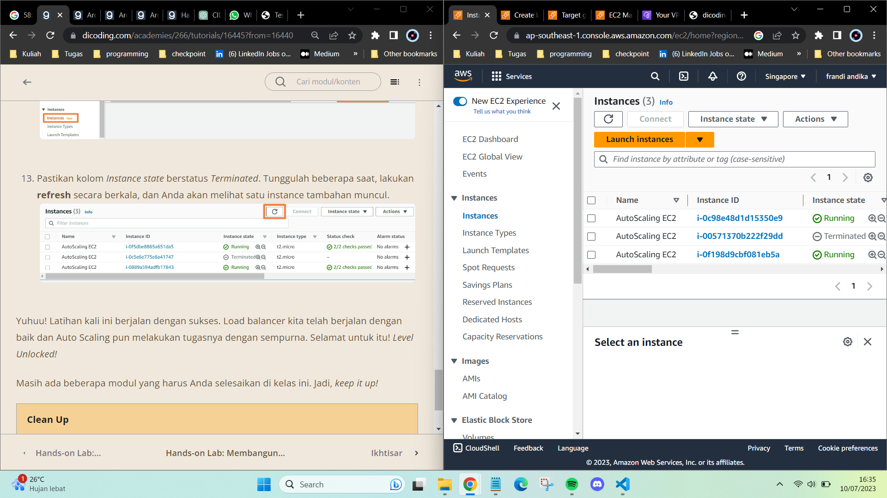

## Ikhtisar Elastisitas, Ketersediaan Tinggi, dan Pemantauan

Di modul ini kita telah belajar banyak hal mengenai elastisitas, ketersediaan tinggi, dan pemantauan. Mari kita jabarkan:

1. Kita belajar mengenai apakah elastisitas itu dan mengapa elastisitas penting bahkan merupakan kunci dari cara cloud bekerja. 

2. Kita juga telah memahami bahwa untuk memperoleh elastisitas, kita membutuhkan solusi pemantauan yang mumpuni.

3. Kita pun sudah membahas empat jenis solusi pemantauan di AWS yaitu, AWS Cost Explorer, Amazon CloudWatch, AWS CloudTrail, dan VPC Flow Logs.

4. Terakhir, di modul ini kita juga belajar bahwa scaling database berbeda dari scaling server lain, misalnya web server. 

Oke, itulah pembahasan kita kali ini mengenai elastisitas, ketersediaan tinggi, dan pemantauan. Selanjutnya, Anda akan belajar ke level tinggi. Maka dari itu, tetap semangat ya!

### Hands-On : 
- [x] Hands-on Lab: Membangun Arsitektur yang Highly Available (Sangat Tersedia) 
- [x] Hands-on Lab: Membangun Arsitektur yang Highly Available (Sangat Tersedia) - Membuat Load Balancer
- [x] Hands-on Lab: Membangun Arsitektur yang High Available (Sangat Tersedia) - Meluncurkan Auto Scaling
- [x] Hands-on Lab: Membangun Arsitektur yang High Available (Sangat Tersedia) - Pengujian

### Hasil Pengerjaan Hands-On :
1. 
2. 
3. 
