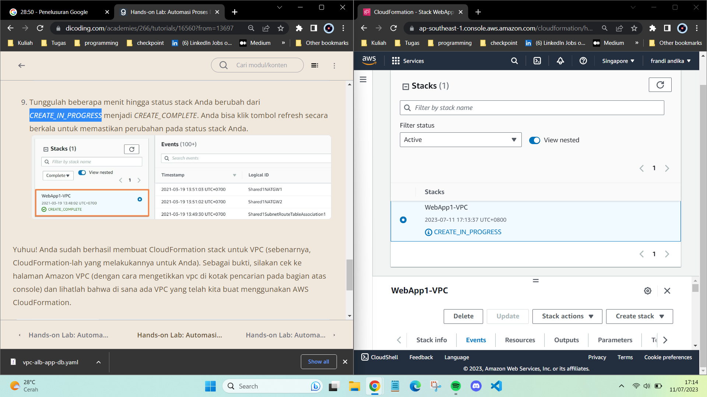

# Ikhtisar Automation

Satu pertanyaan yang sering muncul saat Anda membangun arsitektur di AWS adalah tentang berbagai layanan yang menyediakan kemampuan manajemen aplikasi dan di mana batas kontrol pengelolaannya. Tentu, hal itu sangat tergantung pada tingkat kenyamanan dan sejauh mana kontrol yang Anda butuhkan. Silakan amati gambar di bawah ini.

 Fig.1 - Automation src : amazon cloudfront 

### Mari kita ingat kembali apa saja pembahasan yang kita lalui pada modul ini, yakni:
## AWS Elastic Beanstalk
AWS Elastic Beanstalk adalah layanan aplikasi yang mudah digunakan untuk membuat aplikasi web dengan container yang populer seperti Java, PHP, Node.js, Python, Ruby, dan Docker. Jika Anda ingin mengunggah kode dan tidak perlu membangun dan menyesuaikan lingkungan Anda secara manual, Elastic Beanstalk adalah pilihan yang tepat.

## AWS OpsWorks
AWS OpsWorks memungkinkan Anda meluncurkan aplikasi, menentukan arsitekturnya, serta spesifikasi setiap komponen termasuk instalasi paket, konfigurasi perangkat lunak, dan resource (seperti penyimpanan). Anda dapat menggunakan template untuk teknologi umum (server aplikasi, database, dll) atau Anda dapat membuat template sendiri.

## AWS CloudFormation
AWS CloudFormation adalah mekanisme penyediaan/pembuatan arsitektur yang baik untuk berbagai resource AWS dan dari pihak ketiga. Layanan ini mendukung kebutuhan infrastruktur untuk berbagai jenis aplikasi, seperti aplikasi perusahaan, aplikasi lawas, aplikasi yang dibangun menggunakan berbagai resource AWS, dan solusi berbasis container (termasuk yang dibuat menggunakan AWS Elastic Beanstalk).

Tak hanya itu, AWS CloudFormation juga mendukung AWS OpsWorks dan AWS Elastic Beanstalk.

## Video Automation di AWS
https://youtu.be/NACJllOP1Wk

## Hands-On :
- [x] Hands-on Lab: Automasi Proses Deploy Infrastruktur dengan AWS CloudFormation
 ### tahapan-tahapan yang akan kita lakukan di latihan ini:
- Men-deploy VPC menggunakan AWS CloudFormation.
- Men-deploy aplikasi web dan infrastructure menggunakan AWS CloudFormation.
- Menguji aplikasi web.
- Mengulas CloudFormation template.
- Memperbarui CloudFormation stack untuk menambahkan S3 bucket.
- Menghapus CloudFormation stack.

- [x] Hands-on Lab: Automasi Proses Deploy Infrastruktur dengan AWS CloudFormation - Deploy VPC

 Fig.1 - Pembuatan CloudFormation Untuk Deploy VPC Secara Automasi

- [x] Hands-on Lab: Automasi Proses Deploy Infrastruktur dengan AWS CloudFormation - Deploy Aplikasi Web dan Infrastruktur