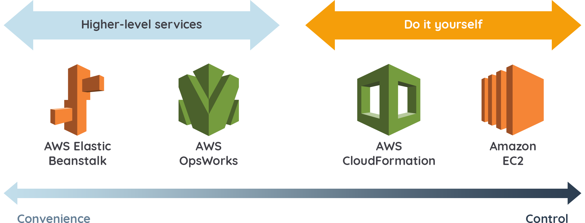

# Ikhtisar Automation

Satu pertanyaan yang sering muncul saat Anda membangun arsitektur di AWS adalah tentang berbagai layanan yang menyediakan kemampuan manajemen aplikasi dan di mana batas kontrol pengelolaannya. Tentu, hal itu sangat tergantung pada tingkat kenyamanan dan sejauh mana kontrol yang Anda butuhkan. Silakan amati gambar di bawah ini.

<div align="center">

<p> Fig.1 - Automation src : amazon cloudfront </p>
</div>


### Mari kita ingat kembali apa saja pembahasan yang kita lalui pada modul ini, yakni:
## AWS Elastic Beanstalk
AWS Elastic Beanstalk adalah layanan aplikasi yang mudah digunakan untuk membuat aplikasi web dengan container yang populer seperti Java, PHP, Node.js, Python, Ruby, dan Docker. Jika Anda ingin mengunggah kode dan tidak perlu membangun dan menyesuaikan lingkungan Anda secara manual, Elastic Beanstalk adalah pilihan yang tepat.


## AWS OpsWorks
AWS OpsWorks memungkinkan Anda meluncurkan aplikasi, menentukan arsitekturnya, serta spesifikasi setiap komponen termasuk instalasi paket, konfigurasi perangkat lunak, dan resource (seperti penyimpanan). Anda dapat menggunakan template untuk teknologi umum (server aplikasi, database, dll) atau Anda dapat membuat template sendiri.


## AWS CloudFormation
AWS CloudFormation adalah mekanisme penyediaan/pembuatan arsitektur yang baik untuk berbagai resource AWS dan dari pihak ketiga. Layanan ini mendukung kebutuhan infrastruktur untuk berbagai jenis aplikasi, seperti aplikasi perusahaan, aplikasi lawas, aplikasi yang dibangun menggunakan berbagai resource AWS, dan solusi berbasis container (termasuk yang dibuat menggunakan AWS Elastic Beanstalk).

Tak hanya itu, AWS CloudFormation juga mendukung AWS OpsWorks dan AWS Elastic Beanstalk.

## Video Automation di AWS
https://youtu.be/NACJllOP1Wk

## Hands-On :
- [x] **Hands-on Lab: Automasi Proses Deploy Infrastruktur dengan AWS CloudFormation**
 ### Tahapan-tahapan yang di lakukan pada latihan ini:
- Men-deploy VPC menggunakan AWS CloudFormation.
- Men-deploy aplikasi web dan infrastructure menggunakan AWS CloudFormation.
- Menguji aplikasi web.
- Mengulas CloudFormation template.
- Memperbarui CloudFormation stack untuk menambahkan S3 bucket.
- Menghapus CloudFormation stack.

- [x] **Hands-on Lab: Automasi Proses Deploy Infrastruktur dengan AWS CloudFormation - Deploy VPC**

<div align="center">

<p> Fig.2 - Pembuatan CloudFormation Untuk Deploy VPC Secara Automasi</p>
</div>

- [x] **Hands-on Lab: Automasi Proses Deploy Infrastruktur dengan AWS CloudFormation - Deploy Aplikasi Web dan Infrastruktur CloudFormationLab**

<div align="center">

<p> Fig.3 - Pembuatan CloudFormation Stack Dengan Nama CloudFormationLab Menggunakan Template YAML Dari Dicoding 
(https://dicodingawscourse.s3-ap-southeast-1.amazonaws.com/staticwebapp.yaml)
</p>


<p> Fig.4 - EC2 Instance Yang Dibuat Secara Otomatis Dari Cloudformation Stack</p>

<p> Selain itu terdapat DynamoDB table, Application Load Balancer, dan Auto Scaling yang terbuat secara otomatis dengan AWS CloudFormation. </p>
</div>

*catatan di modul ini terdapat bug pada bagian template dikarenakan versi python pada template masih lawas (3.6) solusinya adalah :
mengedit file staticwebapp.yaml -> lalu ubah line 435 dari python3.6 ke python3.9 -> deploy kembali CloudFormationLab*

- [x] **Hands-on Lab: Automasi Proses Deploy Infrastruktur dengan AWS CloudFormation - Menguji Aplikasi Web**

<div align="center">

<p> Fig.5 - Pengujian Aplikasi Web
</p>


<p> Fig.6 - Pengujian Aplikasi Web Setelah Dilakukan Refresh Terdapat Perubahan </p>
</div>

Penjelasan Lebih Lanjut :

- Aplikasi website tersebut menyimulasikan sebuah recommendation engine (mesin pemberi rekomendasi) yang membuat saran yang dipersonalisasi untuk acara TV klasik. Berikut adalah fitur-fiturnya:

- Bagian di atas garis menunjukkan rekomendasi yang dipersonalisasi.
  - Bagian ini menampilkan nama dan acara TV.
  - Cara kerjanya cukup sederhana. Setiap request yang dilakukan akan menampilkan nama pengguna secara acak dan memuat rekomendasi yang dipetakan secara statis ke pengguna tersebut. Nama pengguna, judul acara TV, dan proses pemetaan berada di sebuah DynamoDB table.
- Bagian di bawah garis menunjukkan metadata yang berguna bagi Anda pada latihan kali ini
  - Bagian **instance_id** dan **availability_zone** memudahkan Anda untuk melihat EC2 instance dan Availability Zone mana yang sedang melayani request masuk.

- [x] **Hands-on Lab: Automasi Proses Deploy Infrastruktur dengan AWS CloudFormation - Mengulas CloudFormation Template**


pada hands-on ini kita menjelajahi template dan belajar bagaimana kita bisa men-deploy aplikasi web menggunakan template tersebut.
- Terdapat beberapa bagian yang dijelaskan di dicoding seperti :
 - InstanceType (ni adalah bagian di mana kita bisa memilih tipe instance yang akan digunakan untuk men-deploy server untuk aplikasi web)
 - Web1LaunchConfig (Ini adalah launch configuration yang kita gunakan untuk Auto Scaling)
 - Resources (Bagian ini merupakan “jantung” dari template. Di sinilah Anda menentukan infrastruktur yang akan di-deploy)
  - DynamoDB. Ini adalah Amazon DynamoDB table yang digunakan sebagai recommendation engine pada aplikasi web kita.
 - Outputs (Bagian ini digunakan untuk menampilkan informasi tertentu mengenai sumber daya di dalam CloudFormation stack setelah proses provisioning selesai)
  - Pada kasus ini, kita menggunakan function bawaan !GetAtt untuk mendapatkan DNSName (nama DNS) dari Application Load Balancer.
 -  Metadata (Bagian ini kita gunakan untuk mengelompokkan dan mengatur bagaimana CloudFormation template ditampilkan saat Anda men-deploy template menggunakan AWS Console)

<div align="center">

<p> Fig.7 - Contoh Penjelasan Template
</p>
</div>

- [x] **Hands-on Lab: Automasi Proses Deploy Infrastruktur dengan AWS CloudFormation - Menambahkan S3 Bucket**
- Melakukan update pada CloudFormation stack 
 - Menambahkan konfigurasi YAML Lalu Mengupdate/Mengreplace File YAML Pada AWS Stack Untuk Menambahkan S3 Bucket
```
  MyS3Bucket:
    Type: AWS::S3::Bucket
```
<div align="center">

<p> Fig.8 - Melakukan Update Pada CloudFormation stack Untuk Menambahkan S3 Bucket
</p>
</div>

- [x] Hands-on Lab: Automasi Proses Deploy Infrastruktur dengan AWS CloudFormation - Menghapus Stack


Menghapus Stack Yang Sudah Dibuat Untuk Menghindari Tagihan
