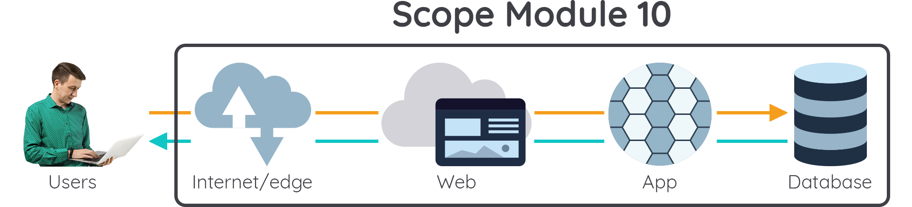

# Ikhtisar Caching

Di modul ini kita telah mempelajari mengenai Caching. Caching dapat dilakukan di semua poin interaksi sebuah aplikasi modern. Cakupan modul ini ditunjukkan pada gambar berikut:

 Fig.1 - Cakupan modul caching 

Mari kita jabarkan setiap poin-poinnya:

1. Caching di tingkat Internet/Edge dapat dilakukan dengan menggunakan Content Distribution Network atau CDN. AWS menawarkan Amazon CloudFront yang merupakan layanan CDN tingkat dunia yang tersebar pada banyak lokasi di seluruh dunia.
2. Di tingkat web server, caching juga dapat dilakukan pada load balancer dengan menggunakan Session Management.
3. Selanjutnya, kita juga telah mempelajari teknik caching dengan menyimpan data yang sering diakses menggunakan in-memory caching. Amazon menawarkan dua jenis in-memory cache, yaitu DAX (DynamoDB Accelerator) atau ElastiCache.
4. Terakhir, kita sudah mempelajari bagaimana menggunakan Arsitektur Cloud AWS beserta komponen-komponennya dapat digunakan untuk membangun aplikasi web secara optimal.