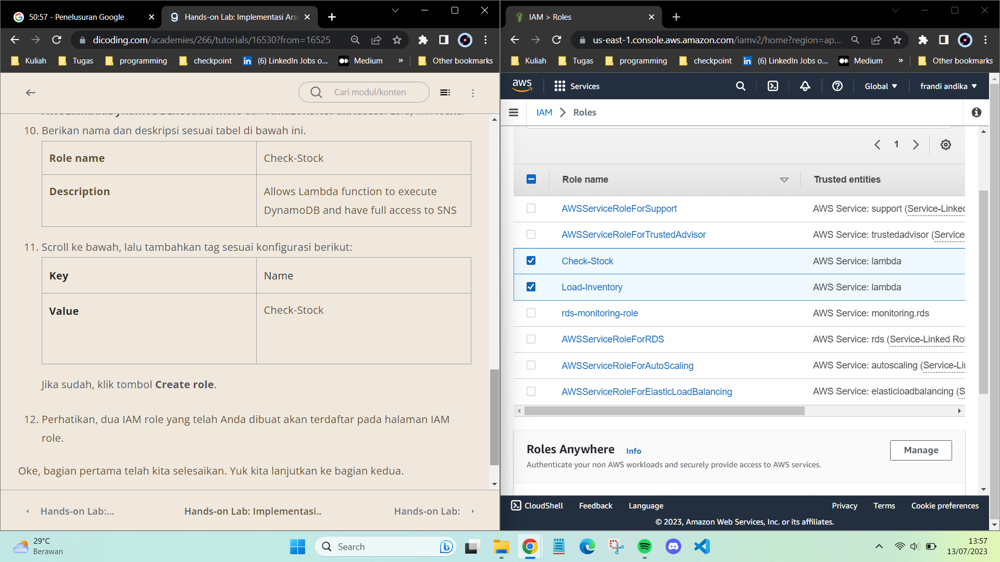
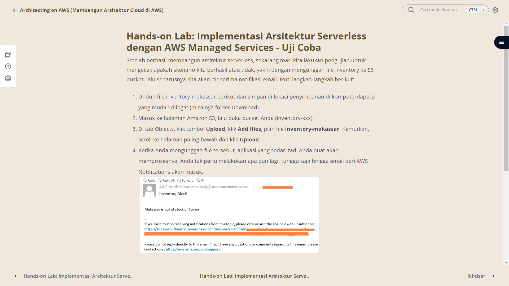
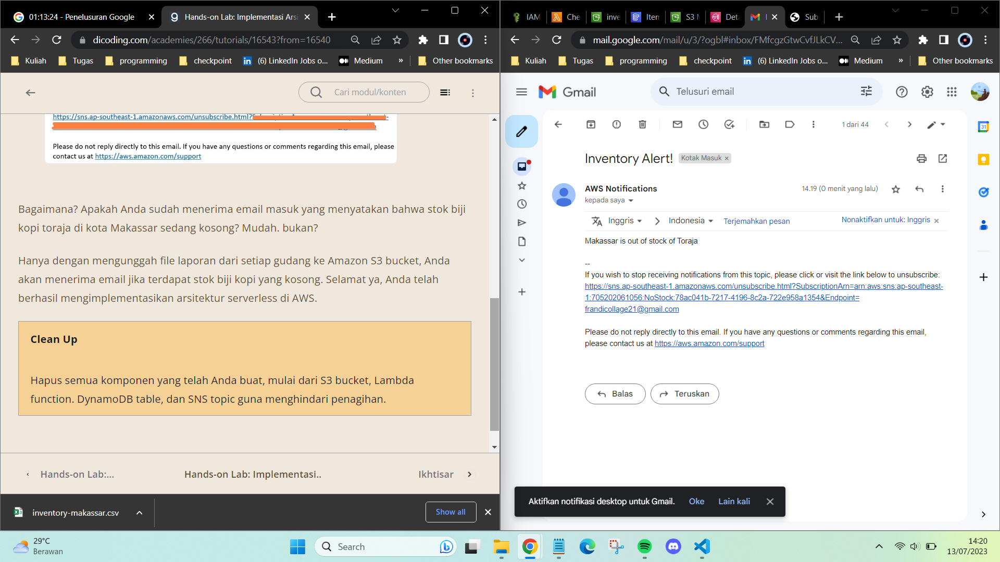

# Ikhtisar Arsitektur Microservices dan Serverless

Dalam modul ini kita telah mempelajari materi-materi yang menarik, di antaranya:

- Apa itu microservices?
- Bagaimana menggunakan container untuk mengubah arsitektur aplikasi Anda menjadi berbasis microservices.
- Jenis-jenis layanan container di AWS, yaitu Amazon ECS dan Fargate.
- Apa itu serverless?
- Bagaimana menggunakan AWS Lambda dan AWS API Gateway sebagai dasar dari arsitektur serverless.
- Bagaimana menggunakan AWS Step Functions untuk mengatur langkah atau state dari AWS Lambda dan API Gateway.

## Video Arsitektur Microservices dan Serverless
https://www.youtube.com/watch?v=DfmJFFYd9nQ

### Hands-On 

- [x] **Hands-on Lab: Implementasi Arsitektur Serverless dengan AWS Managed Services**

<div align="center">

<p> Fig.1 - Workflow Yang Akan Dibuat Pada Latihan Hands-on </p>
</div>

Mari kita uraikan lebih lanjut.

1. Pertama, kita mengunggah file inventory yang sudah disediakan ke Amazon S3 bucket.
2. AWS Lambda function (fungsi yang pertama) akan ter-trigger dan kemudian melakukan aksi penulisan item dari file inventory tersebut ke DynamoDB table.
3. Ketika item sudah termuat ke Amazon DynamoDB table, AWS Lambda function (fungsi yang kedua) akan ter-trigger dan memeriksa item. Jika terdapat nilai nol, maka akan mengirim pesan ke Amazon SNS.
4. Kemudian, Amazon SNS akan mengirimkan notifikasi ke email Anda.
Nah, untuk membangun arsitektur seperti gambar di atas, kita akan melakukan beberapa tahapan, antara lain:

- Membuat IAM role.
- Membuat AWS Lambda function pertama, Amazon S3 bucket, dan Amazon DynamoDB table.
- Membuat Amazon SNS topic dan AWS Lambda function kedua.
- Menguji coba.

- [x] **Hands-on Lab: Implementasi Arsitektur Serverless dengan AWS Managed Services - Membuat IAM Role**
membuat IAM role untuk masing-masing AWS Lambda function. 
- Pada AWS Lambda function 1, ia akan memiliki permission untuk membaca Amazon S3 bucket dan akses penuh terhadap Amazon DynamoDB table (Load-Inventory)
- Sedangkan AWS Lambda function 2, ia akan memiliki permission untuk mengeksekusi DynamoDB table dan akses penuh ke Amazon SNS (Check-Stock)

<div align="center">

<p> Fig.2 - Pembuatan role IAM Load-Inventory, Dan Check-Stock</p>
</div>

- [x] **Hands-on Lab: Implementasi Arsitektur Serverless dengan AWS Managed Services - Membuat Lambda function 1, S3 bucket, dan DynamoDB table**
Membuat AWS Lambda function membaca file yang diunggah di S3, lalu memuatnya dengan sempurna ke DynamoDB table
Pada step 5-6 kita membuat lambda function yang ada kode python :
```
lambda_function_Load-Inventory.py
(kode bisa dilihat pada bagian resource Ho12)
```
step 19 terdapat file csv yang disimpan pada file Resource

- [x] **Hands-on Lab: Implementasi Arsitektur Serverless dengan AWS Managed Services - Membuat SNS topic dan Lambda function 2**
Membuat Amazon SNS topic dan AWS Lambda function kedua
Pada pembuatan lambda function ada kote pyhton :
```
lambda_function_Check-Stock.py
(kode bisa dilihat pada bagian resource Ho12)
```

- [x] **Hands-on Lab: Implementasi Arsitektur Serverless dengan AWS Managed Services - Uji Coba**
<div align="center">

<p> Fig.3 - Langkah - Langkah Uji Coba </p>


<p> Fig.4 - Hasil Pengecekan Database Makassar</p>
</div>

