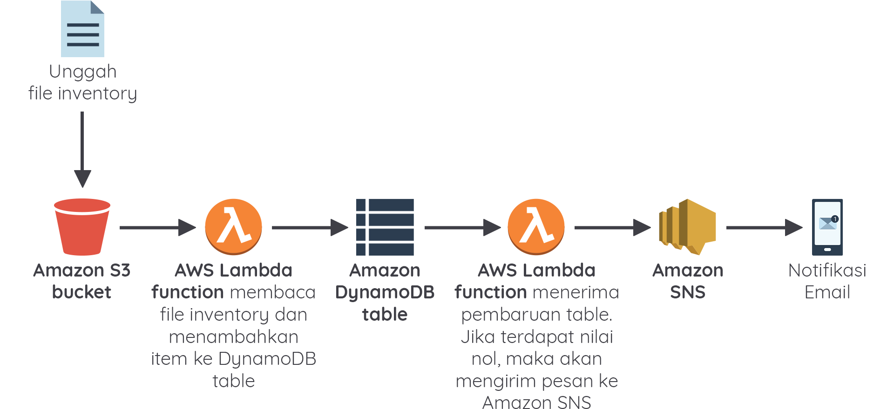

# Ikhtisar Arsitektur Microservices dan Serverless

Dalam modul ini kita telah mempelajari materi-materi yang menarik, di antaranya:

- Apa itu microservices?
- Bagaimana menggunakan container untuk mengubah arsitektur aplikasi Anda menjadi berbasis microservices.
- Jenis-jenis layanan container di AWS, yaitu Amazon ECS dan Fargate.
- Apa itu serverless?
- Bagaimana menggunakan AWS Lambda dan AWS API Gateway sebagai dasar dari arsitektur serverless.
- Bagaimana menggunakan AWS Step Functions untuk mengatur langkah atau state dari AWS Lambda dan API Gateway.

## Video Arsitektur Microservices dan Serverless
https://www.youtube.com/watch?v=DfmJFFYd9nQ

### Hands-On 

- [x] **Hands-on Lab: Implementasi Arsitektur Serverless dengan AWS Managed Services**

 Fig.1 - Workflow Yang Akan Dibuat Pada Hands-on 

Mari kita uraikan lebih lanjut.

1. Pertama, kita mengunggah file inventory yang sudah disediakan ke Amazon S3 bucket.
2. AWS Lambda function (fungsi yang pertama) akan ter-trigger dan kemudian melakukan aksi penulisan item dari file inventory tersebut ke DynamoDB table.
3. Ketika item sudah termuat ke Amazon DynamoDB table, AWS Lambda function (fungsi yang kedua) akan ter-trigger dan memeriksa item. Jika terdapat nilai nol, maka akan mengirim pesan ke Amazon SNS.
4. Kemudian, Amazon SNS akan mengirimkan notifikasi ke email Anda.
Nah, untuk membangun arsitektur seperti gambar di atas, kita akan melakukan beberapa tahapan, antara lain:

- Membuat IAM role.
- Membuat AWS Lambda function pertama, Amazon S3 bucket, dan Amazon DynamoDB table.
- Membuat Amazon SNS topic dan AWS Lambda function kedua.
- Menguji coba.

- [x] **Hands-on Lab: Implementasi Arsitektur Serverless dengan AWS Managed Services - Membuat IAM Role**