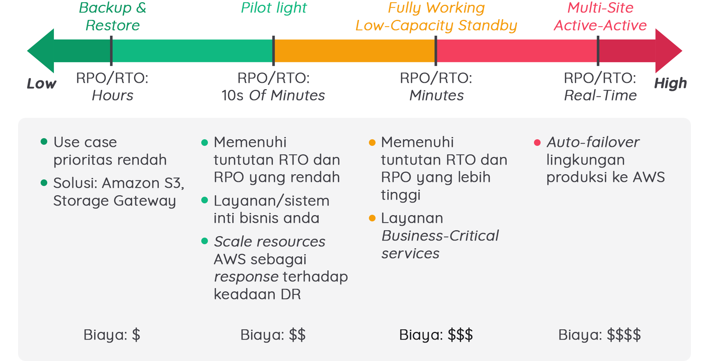

# Ikhtisar RTO/RPO dan Backup Recovery Setup
Saat membangun aplikasi, ia bisa menjadi hal yang kompleks untuk dikelola. Kelangsungan bisnis memastikan bahwa bisnis akan terus beroperasi atau pulih dengan cepat meskipun terjadi bencana serius.

Pada modul ini, kita telah belajar beberapa hal dalam mempersiapkan pemulihan jika terjadi bencana, seperti konsep Availability, RPO dan RTO, dan layanan AWS untuk Disaster Recovery. Kita juga telah menguraikan empat skenario Disaster Recovery (DR) yang menyoroti penggunaan AWS dan on-premise, di antaranya:

- Backup and Restore
- Pilot Light
- Fully Working Low-Capacity Standby Sepenuhnya
- Multi-Site Active-Active

Perhatikan gambar di bawah ini:

 Fig.1 - 
Gambar di atas menunjukkan spektrum untuk empat skenario yang disusun berdasarkan seberapa cepat sistem dapat tersedia bagi pengguna setelah peristiwa DR

AWS memungkinkan Anda untuk mengoperasikan setiap strategi DR ini dengan hemat biaya. Jika aplikasi Anda sudah berjalan di AWS, maka Anda bisa menggunakan implementasi multi Region dan menerapkan strategi DR yang baru saja kita pelajari.